# Supervised machine learning for compressing the solar simulation data
Here we are trying to use supervised neural network for compressing MURaM simulation of solar atmosphere. The goal is to try and compress the fits cube from the simulation to a smaller size using ML.

In this directory there are a couple of notebooks with different sizes of neural networks and different aproaches in normalization of targeted physical parameters to explore how it influences the compression of the data.

- Notebooks are named **`nn-compression_{normalization}_{ratio}.ipynb`**, e.g. `nn-compression_log_224.8.ipynb`
> If there is blank space for normalization that implies standard normalization
- Compression ratio is defined as:

$$\text{compression ratio} = \frac{\text{bytes in all targets}}{\text{no. of parameters} \times 4}$$

> Multiplied by 4 because network parameters are stored as float32 (4 bytes each)
- As it follows the best performing model is the one that compresses the size the lest, which is 5.3 times. In the results we will show plots of $p$ - pressure and $B_z$ - magnetic field in z direction. We will show $p$ because it has the lowest relative error and $B_z$ because it has the largest from all the physical parameters trough all the models
- Next to the model sizes we also investigated how normalization of $B$ and $p$ influenced the learning of models. We have only done this for 55.1 and 224.8 models, which are not the best performing ones :/

## Results
### 5.3 compression

  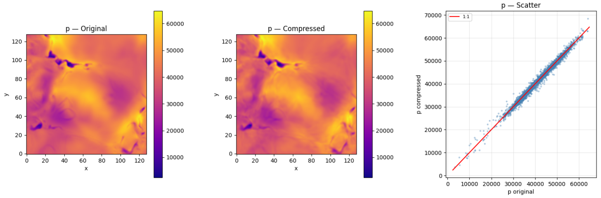
   
  <em>Image 1: z = 96 km slice of pressure</em>

  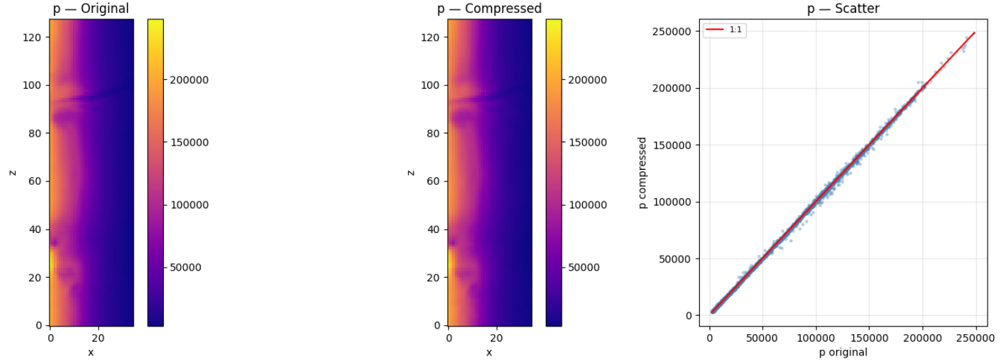
   
  <em>Image 2: y[64] slice of pressure</em>

  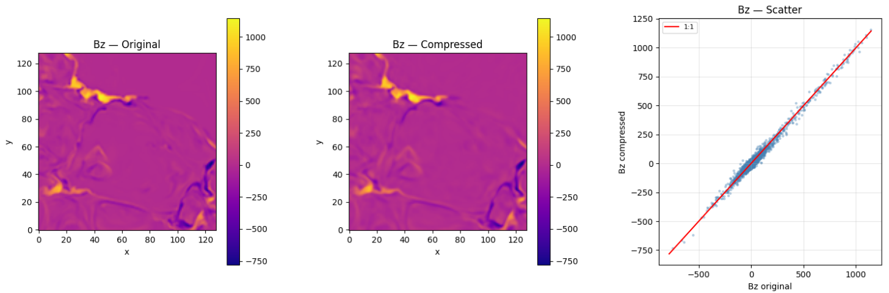
   
  <em>Image 3: z = 96 km slice of B(z)</em>

  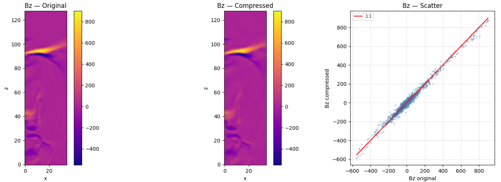
   
  <em>Image 4: y[64] slice of B(z)</em>

### 17.2 compression

  
   
  <em>Image 5: z = 96 km slice of pressure</em>

  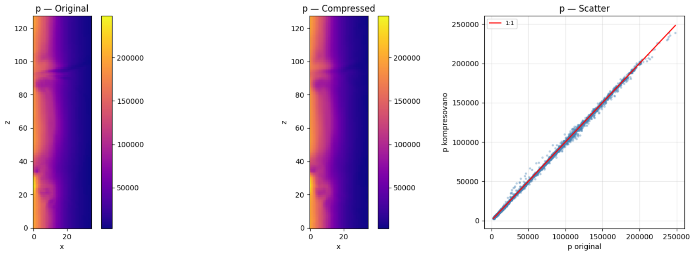
   
  <em>Image 6: y[64] slice of pressure</em>

  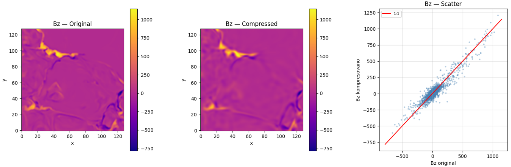
   
  <em>Image 7: z = 96 km slice of B(z)</em>

  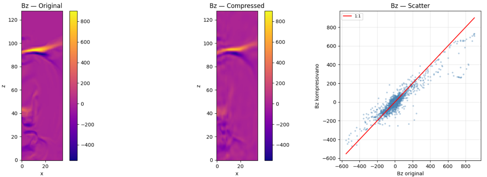
   
  <em>Image 8: y[64] slice of B(z)</em>

### 55.1 compression + arcsinh norm
The next images are only z slices (x-y). Here we show the difference of $p$ and $B_z$ with standard normalization and compared to mixed normalization. In *arcsinh* normalization we have only used this normalization for $B(x,y,z)$ for all other physical parameters we used standarad norm.

  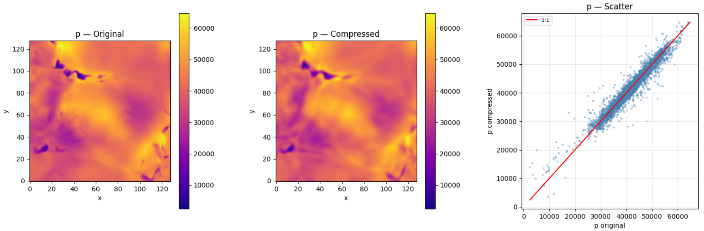
   
  <em>Image 9: Standard normalization; z = 96 km slice of pressure</em>

  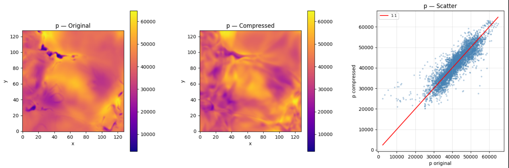
   
  <em>Image 10: Arcsinh normalization for mag. field; z = 96 km slice of pressure</em>

Magnetic filed $B_z$:

  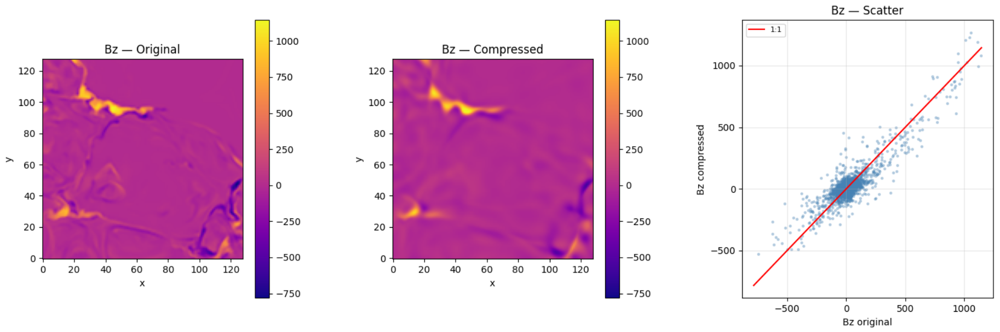
   
  <em>Image 11: Standard normalization; y[64] slice of B(z)</em>

  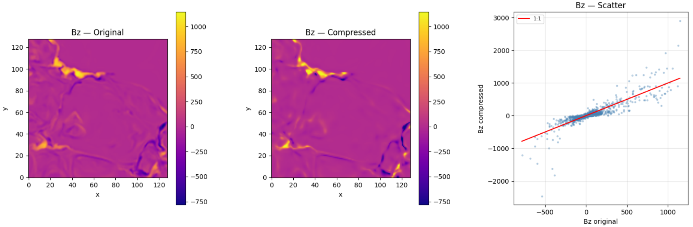
   
  <em>Image 12: Arcsinh normalization for mag. field; y[64] slice of B(z)</em>

### 224.8 compression + log norm
The next images are only z slices (x-y). Here we show the difference of $p$ and $B_z$ with standard normalization and compared to mixed normalization. In *log* normalization we have only used this normalization for $B(x,y,z)$ and $p$ for all other physical parameters we used standarad norm.

  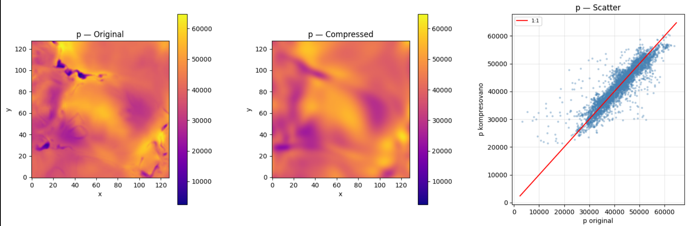
   
  <em>Image 13: Standard normalization; z = 96 km slice of pressure</em>

  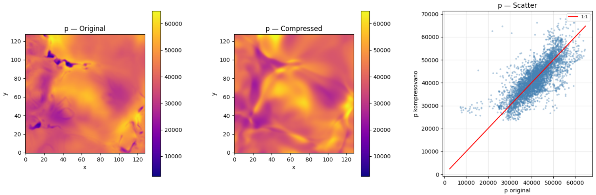
   
  <em>Image 14: Log normalization for mag. field and pressure; z = 96 km slice of pressure</em>

Magnetic filed $B_z$:

  
   
  <em>Image 15: Standard normalization; y[64] slice of B(z)</em>

  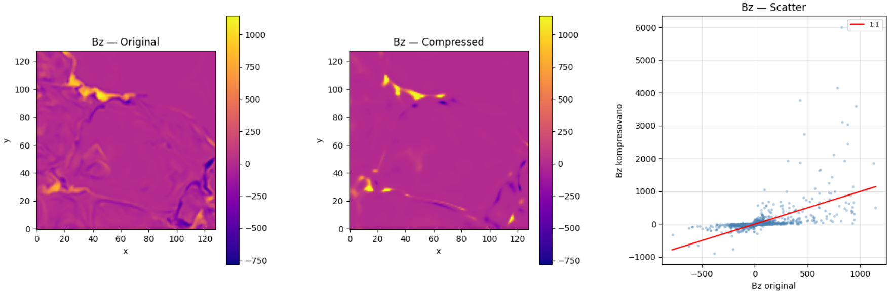
   
  <em>Image 16: Log normalization for mag. field and pressure; y[64] slice of B(z)</em>

